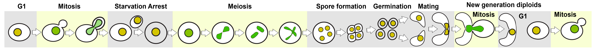
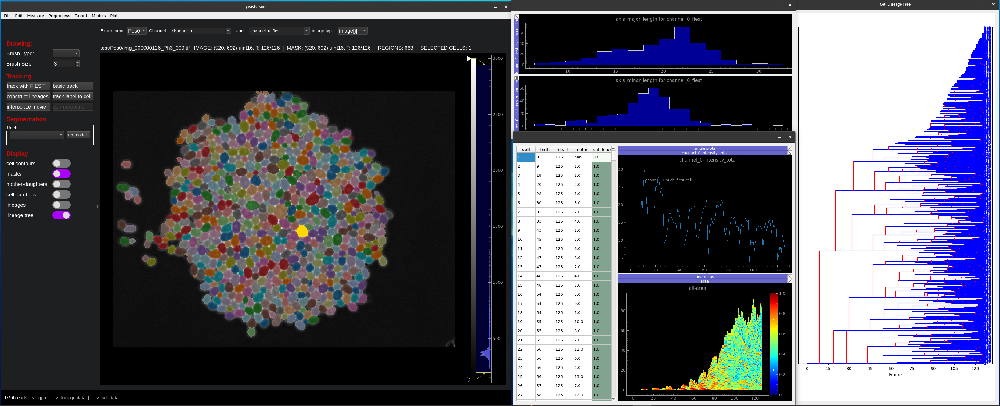
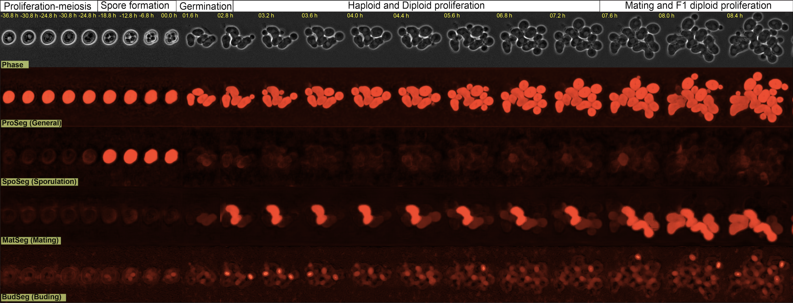

# 
  <b>YeastVision </b> 

A GUI-based framework for segmentation, tracking, time-series analysis of the full Saccharomyces cerevisiae lifecycle.    

<em>Yeastvision can identify and track a single cell throughout all of the stages above</em>

 

### Key Features

- A [generative video interpolation model](#timeseries-analysis-interpolation-tracking-and-plotting) to increase time-series resolution up to 16x
- Load, analyze, and segment [multiple experiments containing numerous phase/flourescent channels](#directory-conventions-ensure-the-gui-can-parse-your-data)
- [Segment](#segmentation) cytoplasm, vacuoles, buds, mating, and sporulating yeast cells
- [Track and reconstruct lineages](#timeseries-analysis-interpolation-tracking-and-plotting) of large cell colonies
- Extract and plot [time-series](#timeseries-analysis-interpolation-tracking-and-plotting) data in the GUI

# Installation

## Local installation (< 2 minutes)

### System requirements

This package supports Linux, Windows and Mac OS (versions later than Yosemite). GPU support is available for NVIDIA GPU's. A GPU is recommended, but not required, to run `yeastvision`
 
### Instructions 

If you have an older `yeastvision` environment you should remove it with `conda env remove -n yeastvision` before creating a new one. 

`yeastvision` is ready to go for cpu-usage as soon as it downloaded. GPU-usage requires some additional steps after download. To download:

1. Install an [Anaconda](https://www.anaconda.com/products/distribution) distribution of Python. Note you might need to use an anaconda prompt if you did not add anaconda to the path.
2. Open an anaconda prompt/command prompt
3. Create a new environment with `conda create --name yeastvision python=3.10.0`. 
4. Activate this new environment by running `conda activate yeastvision`
5. Run `python -m pip install yeastvision` to download our package plus all dependencies
6. Download the weights [online](https://drive.google.com/file/d/1PuI6UIwKyuAUBoRnzjlZWkuT5p6_PX_C/view?usp=sharing). 
7. Run `install-weights` in the same directory as the *yeastvision_weights.zip* file

You should upgrade yeastvision (package [here](https://pypi.org/project/yeastvision/)) periodically as it is still in development. To do so, run the following in the environment:

~~~sh
python -m pip install yeastvision --upgrade
~~~

### Using YeastVision with Nvidia GPU

Again, ensure your yeastvision conda environment is active for the following commands.

To use your NVIDIA GPU with python, you will first need to install the NVIDIA driver for your GPU, check out this [website](https://www.nvidia.com/Download/index.aspx?lang=en-us) to download it. Ensure it is downloaded and your GPU is detected by running `nvidia-smi` in the terminal.

Yeastvision relies on two machine-learning frameworks: `tensorflow` and `pytorch`. We will need to configure both of these packages for gpu usage

#### PyTorch

First, we need to remove the CPU version of torch:
~~~
pip uninstall torch
~~~
And the cpu version of torchvision:
~~~
pip uninstall torchvision
~~~

Now install `torch` and `torchvision` for CUDA version 11.3 (Ensure that your nvidia drivers are up to date for version 11.3 by running `nvidia-smi` and check that a version >=11.3 is displayed in the top right corner of the output table).
~~~
conda install pytorch==1.12.0 torchvision==0.13.0 cudatoolkit=11.3 -c pytorch
~~~~

After install you can check `conda list` for `pytorch`, and its version info should have `cuXX.X`, not `cpu`.

#### Tensorflow

All we need to do here is install the cuDNN package for tensorflow gpu usage
~~~
conda install cudnn=8.1.0
~~~

## Common Installation Problems

You may receive the following error upon upgrading `torch` and `torchvision`:
~~~
AttributeError: partially initialized module 'charset_normalizer' has no attribute 'md__mypyc' (most likely due to a circular import)
~~~
This is solved by upgrading the charselt_normalizer package with the following command: 

`pip install --force-reinstall charset-normalizer==3.1.0`

If you get a version error for `numpy`, run the following commands:

`pip uninstall numpy; pip install numpy==1.24`

# Run yeastvision locally

The quickest way to start is to open the GUI from a command line terminal. Activate the correct conda environment, then run:
~~~~
yeastvision
~~~~

## To begin, drag and drop a directory containing images, flourescence channels, and masks into the GUI.
A single directory represents an experiment and will be added to a drop down at the top of the GUI after being loaded either through drag and drop, or the file dropdown.

Multiple directories can be added, and you can toggle through experiments as you analyze them in the GUI. 

As you utilize GUI features, all GUI-generated labels and images will be stored in the experiment directory as .npz files. Deleting these files will result in a loss of this GUI-generated data. 

### Directory Conventions: Ensure the GUI can parse your data 
*Yeastvision* is hardcoded to recognize several standard conventions when loading an experiment directory:
1. <u>**A directory must contain images** to be analyzed but does not have to contain masks</u>
2. A single file within the directory should contain a single image only.
3. All channel and mask types should be present in the same number of time points. 
4. All files should include an appropriate file extension, and file extensions should remain consistent across data types

__Naming: Files should be named accordingly to their channel and mask type__:
1. Each data type in the directory should have a standard id to identify it.
2. The id should directly follow the file extension
3. Any image that acts as a label should have `_mask` in the id.
4. Ensure that distinct channels have distinct ids.

Here is an example of an experiment with two time points, two channels, and two pre-generated labels, sorted by name:

*im001_channel1.tif, im001_channel2.tif, im001_mask1.tif, im1_mask002.tif, im002_channel1.tif, im002_channel2.tif, im002_mask1.tif, im002_mask2.tif*

# GUI Features

## Segmentation

<em>Yeastvision contains models and tracking algorithms to analyze all stages of the yeast lifecycle</em>

**Pixel flow-based models**

| Model  | Segments |
| ------ | -------- |
| proSeg | proliferating cells (general cytoplasm segmentation) |
| spoSeg | sporulating cells |
| matSeg | mating cells
| budSeg | bud-necks |

**Conventional U-NET models**
| Model  | Segments |
| ------ | -------- |
| budNET | bud-necks (optimized for crowded conditions) |
| vacNET | vacuoles |

## Model Retraining
1. Load Training Masks
2. Select the model to be retrained from the mainscreen model dropdown 
3. Click Menu->Models->Retrain
4. Ensure training data is correct and choose model suffix (default is date-time)
5. Select hyperparameters (default should work for most use cases)
6. Train the model, using terminal to gauge progress. 
7. The custom model will auto-run on the next available image in the training set, if there is not a mask already on this image. 
8. If you are happy with the new model, go to Menu->Models->Load Custom Models, and the model will be added to the model dropdown. Otherwise, retrain with new data

#### Retraining Tips
- Training takes very long without a GPU even though it possible to retrain using only CPU. 
- When you are initially producing a training set, leave some blank masks towards the end of the movie so that the training procedure has room to auto-run
- The path to the new weights will be printed on the terminal. 
- Ensure that the fullname of the retrained model is present in the weights filename upon trying to load it via the models menu. This ensures that GUI can associate the weights with the correct model architecture 

## Timeseries analysis: interpolation, tracking, and plotting
1) Optional: Interpolate images to increase resolution, generating intermediate frames that improve tracking accuracy
2) Segment and track the interpolated frame. Tracking automatically generates a cell data table that includes various morphological and image properties of each cell over each frame in the movie. 
3) Optional: reconstruct proliferating cell lineages
4) Remove interpolated frames from the mask, so that only frames present in the original movie exist in the final tracked movie
5) Produce some initial plots of the data using the 'show plot window' button. This will allow you to view single cell and population averages over time.

## Keyboard Shortcuts

| Command     | Function |
| ----------- | ----------|
| up/down     | scroll through channnels|
| cntrl + up/down|  Scroll through labels | 
| right/left arrows | scroll through timeseries |
| cntrl + right/left | scroll through timeseries by 3 |
| O | outline Drawing |
| B | brush Drawing |
| E | eraser |
| .| increment brush size |
| , | decrecement brush size
| Delete/Backspace | Delete Selected Cell |
| c | show current label contours |
| f | toggle probability (if present) |
| space bar | toggle mask display |
| p | show plot window |

## Troubleshooting: Common Problems

| Problem     | Solution |
| ----------- | ----------- |
| Cannot scroll through images/masks on the display | Click on the display to bring focus back to this widget|
| Loaded images without masks but cannot draw | An existing label must be present to draw: Add a blank label with File -> Add Blank Label |

